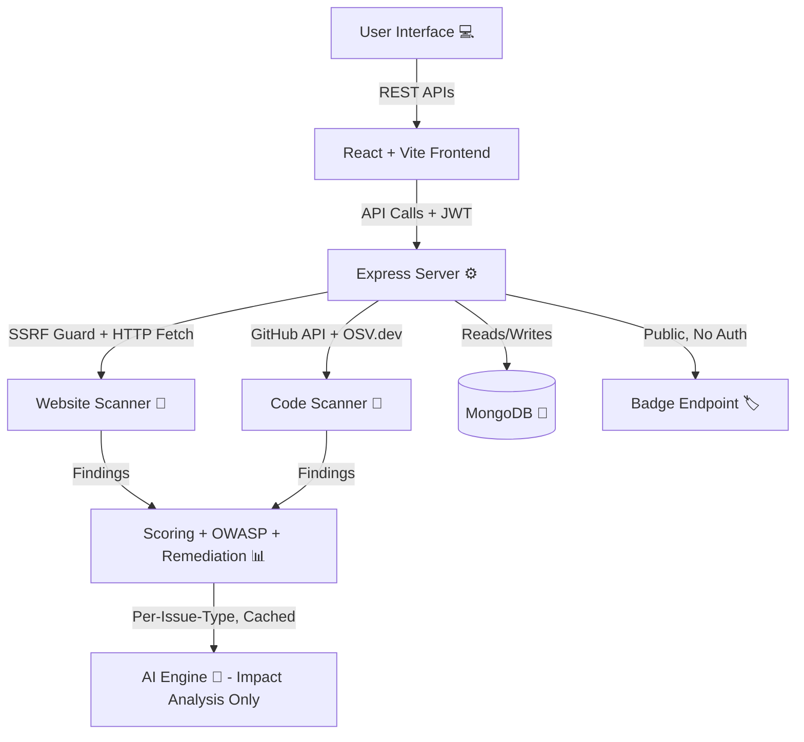

# 🛡️ SentinelAI

> **An AI-assisted guard that watches over your website's security.**
> SentinelAI is a **MERN Stack** web application that scans public websites *and* their source code for common security misconfigurations, maps every finding to the **OWASP Top 10**, calculates a security score, and uses AI to explain what it found in plain English — not a pentest replacement, but an always-on first line of defense.

---

## ✅ Key Highlights
- 🔐 **Authentication:** Register/login with JWT + bcrypt password hashing.
- 📁 **Project Management:** Create and track multiple websites to scan, each owned and scoped per user.
- 🔎 **Security Scanner:** Checks HTTP security headers, HTTPS usage, cookie flags (`Secure`/`HttpOnly`/`SameSite`), and CORS misconfiguration — mapped to OWASP Top 10 categories with a calculated 0–100 score.
- 🛑 **SSRF Protection:** Every scan target is DNS-resolved and rejected if it points at localhost/private/internal infrastructure before any request is made.
- 🎯 **Deterministic Remediation:** Every finding gets an exact, hand-written fix looked up from a checkId-based table — never AI-generated, so the fix is always correct and always present, even if the AI provider is down.
- 🤖 **AI Impact Analysis:** Rather than repeating what the findings list already shows, the AI's only job is explaining a realistic attack scenario for each issue — a genuinely separate piece of information, not a restatement.
- 💰 **Token-Saving AI Cache:** AI impact explanations are cached per issue-type in MongoDB — after the first scan of any given issue, future scans reuse the cached text instead of calling the AI again.
- 🧯 **AI Guardrails:** Defends its own AI layer against OWASP's Top 10 for LLMs — sanitizes any externally-influenced text before it reaches a prompt (indirect prompt injection) and sanitizes AI output before it's stored or displayed (insecure output handling).
- 📊 **Dashboard:** Account-wide stats — total projects, total scans, average score, high/critical count.
- 🕓 **Scan History:** Full history of past scans per project, so score trends over time are visible.
- 🧪 **Code Scanning (SAST-lite + SCA):** Point a project at its GitHub repo to scan the source directly — real dependency-vulnerability checking via the OSV.dev database (checks every `package.json` in the repo, not just the root one), hardcoded-secret detection, and exposed `.env` file detection. Results flow through the exact same scoring/OWASP/remediation/AI pipeline as a live website scan.
- 🏷️ **Live Security Badges:** A public, no-auth SVG badge endpoint per project — embed a live, auto-updating security score directly in your own README, the same way a CI status badge works.

---

## 🖼️ Sneak Peek Preview

### 🔐 Login
<p align="center">
  <!-- TODO: Replace src with actual screenshot path -->
  
</p>

### 📊 Dashboard
<p align="center">
  <!-- TODO: Replace src with actual screenshot path -->
  
</p>

### 🔎 Scan Result
<p align="center">
  <!-- TODO: Replace src with actual screenshot path -->
  
</p>

---

## 🚀 Tech Stack

### 🖥️ Frontend


### ⚙️ Backend


### 🤖 AI


---

## 🧩 Project Overview

SentinelAI acts as an intelligent first line of defense for developers, students, and freelancers who deploy websites without deep security expertise. It performs **passive, deterministic** security checks — never exploitation, never attacks — then hands the results to AI purely to *explain* them, never to *decide* them.

### ✨ Features
- 🔐 Secure authentication & authorization with JWT.
- 📁 Multi-project support — track several websites, each with its own scan history.
- 🔎 OWASP Top 10-mapped security findings with a calculated severity score.
- 🛑 SSRF-guarded scanning — refuses to scan private/internal targets.
- 🎯 Deterministic, per-finding remediation steps, kept separate from AI-generated impact analysis so nothing is ever repeated.
- 🤖 AI-generated, plain-English impact analysis with graceful fallback and prompt-injection/output-sanitization defenses.
- 📊 Account-wide dashboard stats and per-project scan history.
- 🧪 Two scan modes per project — a **website scan** (DAST-style, checks a live running app) and a **code scan** (SAST-lite secret scanning + real SCA dependency-vulnerability checking against a GitHub repo).
- 🏷️ Public, embeddable security-score badges for both scan types.

---

## 🧠 Architecture



---

## ⚡ Folder Structure

```
SentinelAI/
│
├── 📁 server/               # Node + Express + MongoDB
│   ├── src/
│   │   ├── controllers/     # authController, projectController, scanController, dashboardController, badgeController
│   │   ├── models/          # User, Project, Scan, AiExplanationCache
│   │   ├── routes/
│   │   ├── middleware/      # authMiddleware, scanRateLimiter
│   │   ├── scanner/         # runScan.js + checks/*.js + owaspMap.js + remediationMap.js + scoring.js
│   │   ├── codeScanner/     # runCodeScan.js + githubClient.js + checks/*.js (SAST-lite + SCA)
│   │   ├── ai/              # AIProvider interface, gemini/fallback providers, cache, guardrails
│   │   └── utils/           # generateToken, ssrfGuard
│   └── server.js
│
├── 📁 client/                # React + Vite + Tailwind + React Router
│   ├── src/
│   │   ├── pages/           # Login, Register, Dashboard, Scan, History, ...
│   │   ├── context/         # AuthContext
│   │   ├── routes/          # AppRouter, ProtectedRoute
│   │   └── services/        # api.js + auth/projects/scans/dashboard.api.js (scans.api.js covers both scan types)
│   └── ...
│
├── 📁 docs/                  # HLD.md, LLD.md
└── README.md
```

---

## 🧰 Installation & Setup

### 🔹 1. Clone the repository

```bash
git clone https://github.com/Ophidev/SentinelAI.git
cd SentinelAI
```

### 🔹 2. Setup the Backend

```bash
cd server
npm install
```

Create a `.env` file in the `server` directory:

```env
PORT=5000
MONGO_URI=your_mongodb_connection_string
JWT_SECRET=your_secret_key

# Optional — without this, AI explanations use a rule-based fallback,
# the app still works fully with zero setup.
GEMINI_API_KEY=
```

```bash
npm run dev
```

### 🔹 3. Setup the Frontend

```bash
cd client
npm install
npm run dev
```

* Frontend → `http://localhost:5173`
* Backend → `http://localhost:5000`

---

## 🔒 Security Highlights

- **SSRF Protection:** DNS-resolves every scan target and rejects private/internal IP ranges before making any request.
- **OWASP Top 10 Mapping:** Every finding is deterministically mapped to an OWASP category — the AI never decides what counts as a vulnerability.
- **AI Guardrails (OWASP Top 10 for LLMs):** Defends against indirect prompt injection (LLM01) and insecure output handling (LLM02) in its own AI layer.
- **Rate Limiting:** Scan creation is rate-limited per user to prevent SentinelAI itself from being abused as a DoS proxy.
- **Public Badge Endpoint, Minimal Exposure:** The badge route intentionally requires no auth (so it works embedded in a README), but only ever reveals a score number and a color — never finding details — and project IDs aren't realistically guessable.
- **Real SCA, Not Just DAST:** Code scans check dependencies against the OSV.dev vulnerability database and flag hardcoded secrets — genuine static analysis, not just live-site header checks.

---

## 🧑‍💻 Author

**👤 Ophidev**
💼 MERN Developer | 🚀 DevOps Learner
🔗 [GitHub](https://github.com/Ophidev)

---

## ⭐ Support

If you find **SentinelAI** useful, please consider giving this repository a **⭐ star**. Your support means a lot! 🙌
